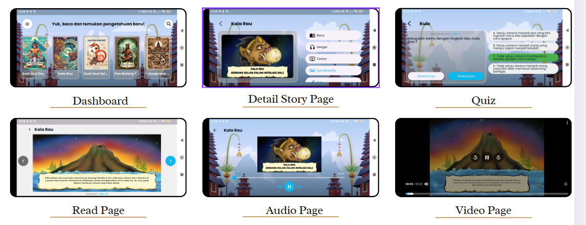

# 🌺 Tarali - Cerita Rakyat Bali

**Tarali** is an interactive e-book mobile application that brings **Balinese folklore** to life through reading, listening, watching, and storytelling features. Designed to enhance **literacy**, **public speaking**, and **cultural preservation**, this app provides a comprehensive and engaging platform for elementary school students to explore traditional stories in a modern format.

---

## 📱 Features
- 📖 **Read**: Traditional Balinese stories in digital format  
- 🔊 **Listen**: Narrated versions to support auditory learners  
- 🎬 **Watch**: Videos for immersive storytelling  
- 🗣️ **Storytelling**: Voice-based performance with scoring using speech analysis  
- ❓ **Quiz**: Fun questions to test story comprehension  
- 👩‍🏫 **Role-based Access**:  
  - **Teachers**: Register via special email authentication to monitor and assess students  
  - **Students**: Register with name, class, and school — no email needed

---

## 🧠 Motivation & Purpose
Tarali was developed as a **thesis project** for our client pursuing a Master's degree in education. The goal was to create a **culturally-relevant**, feature-rich mobile application that not only promotes **literacy and storytelling** skills among children, but also preserves **Balinese heritage** in an accessible digital form.

Tested directly by elementary school students, the app gathered valuable feedback to refine both **usability** and **educational effectiveness**.

---

## 👨‍💻 Tech Stack
- **Flutter** – Cross-platform mobile development  
- **Firebase Firestore** – Realtime NoSQL database  
- **Firebase Storage** – For managing audio, video, and media files  
- **Speech Recognition** – For student storytelling evaluation  

---

## 👥 Team Structure
This 2-month project was executed by a compact yet effective team:
- 🧑‍🎨 1 UI/UX Designer  
- 👨‍💻 2 Flutter Developers (including me)

As a mobile developer, I contributed to:
- Building and structuring the entire app  
- Implementing mockups into responsive UIs  
- Integrating all Firebase services  
- Managing routing and app navigation  
- Ensuring user experience was fluid and intuitive across features

---

## ✨ Lessons Learned
Tarali taught me how to:
- Build a **real-world application** from concept to near-release  
- Work closely in a **small agile team** under academic and technical constraints  
- Implement **Firebase** effectively in a structured, role-based app  
- Test directly with real users (children!) for feedback-driven improvements  

---

## 🚀 Current Status
Tarali is currently in the **preparation phase for Play Store release**, with ongoing testing and polish. It is among the projects I am **most proud of**, both in impact and execution.  

---

## 📸 Screenshots  

---
